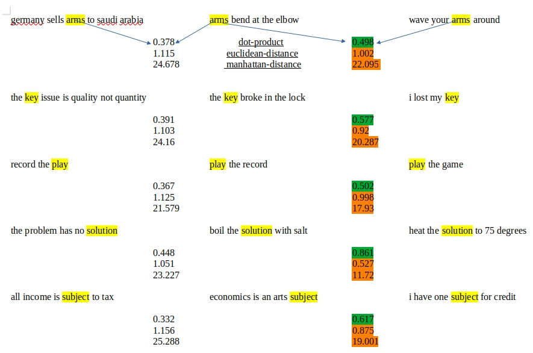

# Context Aware Word Vectors

This is a redo of the code in the repo [Bow to Bert](https://github.com/ashokc/Bow-to-Bert) and the article [Bow to Bert](http://xplordat.com/2019/09/23/bow-to-bert/) to work with current versions of TensorFlow/Pytorch engaged by transformers from Huggingface.

The article details the evolution of word vectors from long, sparse, and one-hot to short, dense, and context sensitive over the years.

Here is updated result for BERT that shows that a word assumes a different numerical vector based on the context, much like the actual contextual meaning of the word.



*BERT embeddings are contextual. Each row shows three sentences. The sentence in the middle expresses the same context as the sentence on its right, but different from the one on its left. All three sentences in the row have a word in common. The numbers show the computed cosine-similarity,euclidean-distane, and manhattan-ditance between the indicated word pairs. BERT embedding for the word in the middle is more similar (larger dot-product & smaller distance) to the same word on the right than the one on the left, for all three of these measures*

##  Summary

Word vectors have evolved over the years to know the difference between "record the play" vs "play the record". They have evolved from a one-hot world where every word was orthogonal to every other word, to a place where word vectors morph to suit the context. Slapping a BoW on word vectors is the usual way to build a document vector for tasks such as classification. But BERT does not need a BoW as the vector shooting out of the top [CLS] token is already fine tuned for the specific classification objective...

##	Requirements

    python >= 3.10

##	Dependencies
    transformers
    pytorch
	tensorflow

## How to run the code here?

    1. Clone this repo

    2. Set up the env:
        python -m venv venv
        source venv/bin/activate
        pip install -r requirements/test-requirements.txt

    3. Run:
        python src/context_aware_word_vectors/context_aware_word_vectors.py

    4. Test:

        pytest -m all --capture=tee-sys

        The tests should succeed ( larger dot_products & smaller distances between the word vector in 2nd/3rd sentences compared to 1st/2nd or 3rd/1st)

You wil see  output like:

```json
{
  "arms": {
    "sentences": {
      "1": "germany sells arms to saudi arabia",
      "2": "arms bend at the elbow",
      "3": "wave your arms around"
    },
    "dot_product": [
      0.378,
      0.498,
      0.422
    ],
    "euclidean_distance": [
      1.115,
      1.002,
      1.075
    ],
    "manhattan_distance": [
      24.678,
      22.095,
      23.414
    ]
  }
}
```
